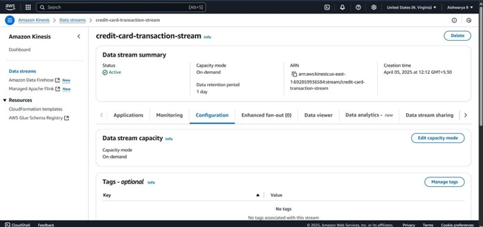

# Real-Time Credit Card Fraud Detection System

-> Architecture Overview

This project implements a real-time credit card fraud detection system using a combination of Docker, AWS Lambda, S3, EventBridge, Kinesis, ECR, CloudWatch, DynamoDB, and SNS. It is built to automatically detect fraudulent credit card transactions with low latency and high scalability.

To simulate real-time transaction processing, the system uses a CSV file that mimics live credit card transactions. The transactions stored in the CSV file are processed similarly to real-time transactions. The file is stored in S3 and triggers the event-driven workflow via AWS services such as EventBridge and Lambda. This setup allows for seamless orchestration and processing of transaction data in real time.

Architecture Diagram: 

1. The data has been preprocessed, and various machine learning models were trained on a Google Colab notebook, with the voting classifier being the best-performing model. All the files, including the model and preprocessing functions, have been stored as pickle files in an S3 bucket.
  - See the full code here: [ml-training-code](2025_Credit_card_fraud_detection_system.ipynb)
1. Docker & ECR: Lambda Container Deployment
The Dockerfile to install the required libraries: [Dockerfile](https://github.com/Aishwarya1223/Real-time-credit-card-fraud-detection-system/blob/main/Dockerfile).
- A Docker image is built locally with all dependencies and a Python-based preprocessing + prediction script.
- The image is pushed to AWS Elastic Container Registry (ECR).
  
- A Lambda function is created from this container to handle preprocessing and prediction
- Lambda Code:
  [lambda-function](https://github.com/Aishwarya1223/Real-time-credit-card-fraud-detection-system/blob/main/lambda_function.py)
2. User Transaction Interface (Desktop App)

- End users simulate or initiate transactions via a desktop application.
- These transactions are stored locally in CSV format.
- 
- The CSV files are then uploaded to an S3 bucket for processing.
  

3. Event-Driven Processing with AWS Services

- AWS CloudTrail is used to monitor S3 events.
- 
- When a new file is uploaded to S3, an EventBridge rule is triggered.
- EventBridge routes the event to the Lambda function.
- Dead Letter Queue (SQS) is configured to catch failed event processing.
- 

4. Lambda Trigger & File Check & Kinesis

- The triggered Lambda:
  - Validates if the uploaded file is a .csv.
  - Converts the CSV data into JSON format.
  - Sends this JSON data to Amazon Kinesis for stream processing.
  - 
  - Lambda Code:
  - 
  - Full Lambda code for sending the data to kinesis in the form of JSON: [lambda-code](lambda-to-send-data-to-kinesis.py)
  - Execution role:
  - 
  - Execution role permissions:
  - 
  - Cloudwatch logs:
  - 
  - Kinesis:
  - 
  - 
     
5. Preprocessing & Classification with Lambda + ECR

- Another Lambda function (from the ECR image) is triggered:
  - It contacts S3 to download a preprocessing Python script (.py file).
    - preprocessing file: [preprocessing-file](preprocessing_functions.py)
  - Applies the exact same preprocessing as was used during model training.
  - Converts JSON to a Pandas DataFrame for smoother handling.
  - Loads the trained classifier model from S3.
  - Performs fraud prediction on the transaction.
  - Lambda Function for preprocessing
  - 
  - Lambda Execution roles and permissions:
  - 

6. Logging & Monitoring

- All transformation steps and errors are logged to Amazon CloudWatch Logs for observability and debugging.

7. Storage & Alerting

- Final predictions (with transaction details) are stored in Amazon DynamoDB.
- If a transaction is classified as fraudulent, a Simple Notification Service (SNS) sends an email alert to the admin.
- 
- 

8. Failure Handling

- If the Lambda function fails during execution, the event is routed to the Dead Letter Queue (SQS) for inspection and retries.

9. Cost Optimization & Archival

- Lifecycle policies are applied on S3:
  - Files older than a threshold (e.g., 180 days) are automatically moved to Glacier (archival).
  - Eventually, these files are deleted to reduce storage costs.
  - S3 bucket
  - 
  - S3 bucket life cycle policy
  - 

-> Technologies Used

  * Service	Purpose
  
    * Docker + ECR	Containerized Lambda deployment
    
    * AWS Lambda	Serverless compute for preprocessing + classification
    
    * Amazon S3	Storage for transaction files and models
    
    * EventBridge + CloudTrail	Event routing upon new S3 uploads
    
    * Amazon Kinesis	Real-time JSON stream processing
    
    * Amazon DynamoDB	NoSQL database to store transaction predictions
    
    * Amazon CloudWatch	Monitoring and logging
    
    * Amazon SNS	Alerting system (Email) for fraud detection
    
    * SQS DLQ	Handling unprocessed or failed events

-> Alerts

  - Admins receive email notifications immediately after a fraudulent transaction is detected via SNS.
  - 
  - 
  - Email notification to the specified email address
  - 
-> Security

  IAM roles are configured to:
  
  - Allow Lambda functions to access only required resources (S3, Kinesis, ECR).
    
  - Trigger Lambda only via authorized EventBridge rules.
  

-> Cost Control

- S3 Lifecycle Policies archive and delete old transaction data.

- Serverless and stream-based design ensures pay-per-use billing.
